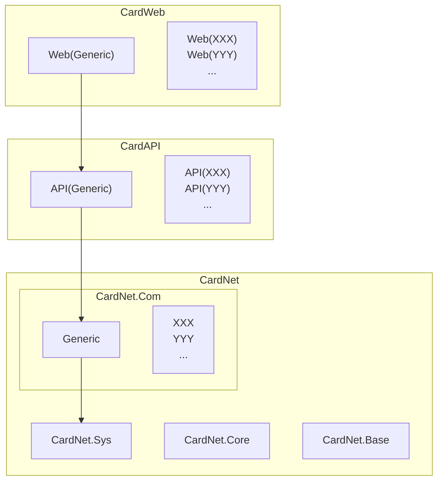

# Cardinn — 设计说明 (design.md)

目标：设计一个通用的数据库读写平台（可扩展、多适配器、JSON-first），并提供接口契约、错误模型、示例与文档生成要点。

目录
- 概览
- 设计目标
- 架构概览（分层）
- 关键契约与接口（概念说明）
- 错误与结果模型
- 数据示例说明（文字形式）
- HTTP API 概要（端点说明）
- 扩展性与适配器模式
- 审计与日志
- 测试与 CI 建议
- 附录：流程说明与变更记录

概览
Cardinn 平台目标是提供一个通用的数据读/写抽象层，支持关系型与非关系型后端（通过适配器）、以 JSON 文档为首选数据载体（支持动态 schema）、并保持小而清晰的接口契约和统一的错误/结果模型。

## 1 设计目标
- 支持动态 JSON 数据（结构由 SYS 层或客户定义）。
- 提供最小 CRUD 能力：Create / Read / Update / Delete。
- 模块化、接口驱动，便于替换不同存储后端。
- 初期不处理并发/事务/复杂错误，后续可扩展。

## 2 核心概念与术语

- collection：逻辑集合，相当于表或 bucket。由 API 路径或配置决定。
- jsonData：表示实体的原始 JSON 文本（字符串），由客户端提供并直接存储或解析后映射。
- id：每条记录的唯一标识（字符串）。
- IStorageAdapter：Base 层对持久化后端的抽象接口。
- ICrudService：Core 层对上层暴露的最小 CRUD 服务接口。

## 2 系统构架图

- CardNet.Base
    - 只包含通用契约/类型。
    - 无任何系统依赖，便于第三方系统直接引用。

- CardNet.Core
    - 定义系统模型

- CardNet.SYS
    - 提供实现

- CardNet.COM
    - 聚合业务方法

- CardAPI
    - HTTP API

- CardWeb
    - 前端展示

## 3 最小接口契约（语义级别）

3.1 Base 层：`IStorageAdapter`（语义说明）

- Create(collection, jsonData) -> Result<string>（返回 id 或错误）
- Read(collection, id) -> Result<string?>（返回 json 字符串或 null）
- Update(collection, id, jsonData) -> Result<bool>
- Delete(collection, id) -> Result<bool>

3.2 Core 层：`ICrudService`（语义说明）

- CreateAsync(collection, jsonData) -> Result<string>
- ReadAsync(collection, id) -> Result<string?>
- UpdateAsync(collection, id, jsonData) -> Result<bool>
- DeleteAsync(collection, id) -> Result<bool>

实现要点：

- Core 层通过依赖注入接收 `IStorageAdapter` 的实现。
- Core 层对输入做最小校验（例如：非空 JSON、合法 JSON），复杂校验留给 SYS/COM 层。

## 4 返回与错误模型（建议）

## 5 OpenAPI 草案说明

## 6 项目结构建议（CardNet 方案）

- CardNet.Base
    - Interfaces/IStorageAdapter.cs
    - Utils/

- CardNet.Core
    - Services/CrudService.cs (实现 ICrudService)
    - DTOs/

- CardNet.SYS
    - SchemaStore/ (保存 JSON Schema 等元数据)

- CardNet.COM
    - Audit/
    - Validation/

外部项目：
- CardAPI（ASP.NET Core Web API）：注入 ICrudService，提供 HTTP 端点。
- CardWeb（示例前端）：调用 CardAPI 并展示数据。

## 7 示例流程（高层）

- 客户端 POST 到 CardAPI；CardAPI 调用 Core.CreateAsync；Core 调用 Base.CreateAsync；Base 返回 id；最终返回 201 Created。
- 客户端 GET → CardAPI → Core.ReadAsync → Base.ReadAsync → 返回 JSON 或 404。
- 
Mermaid 时序图源位于 CardDoc/diagrams/（architecture.mmd、sequence_create.mmd、sequence_read.mmd）。

## 8 测试建议

- 单元测试：覆盖 CRUD 的成功路径与边界条件，使用 InMemory adapter 测试 Core 层。
- 集成测试：使用 WebApplicationFactory 启动测试主机并发起 HTTP 请求断言行为。
- 建议测试清单（示例）：
    - reate_HappyPath_Returns201
    - Read_Existing_Returns200
    - Read_Missing_Returns404
    - Update_Existing_Returns200
    - Delete_Existing_Returns204

## 9 CI 与文档自动化建议

可选：在 CI 中使用 mermaid-cli/plantuml 自动生成图表，并将 SVG 放入 CardDoc/assets，以便 DocFX 稳定渲染。

## 10 后续扩展（路线）

- 阶段 2：添加批量操作、分页/过滤、搜索能力。
- 阶段 3：加入并发控制（ETag/Version）、事务支持（若后端支持）。
- 阶段 4：细化错误码并实现可国际化错误消息。

变更记录
- 2025-10-25 初始设计文档（此版本：删除所有示例代码片段与 Mermaid 区块，统一为纯文本说明，修复未闭合代码块问题）。

### 创建流程图

### 读取流程图

