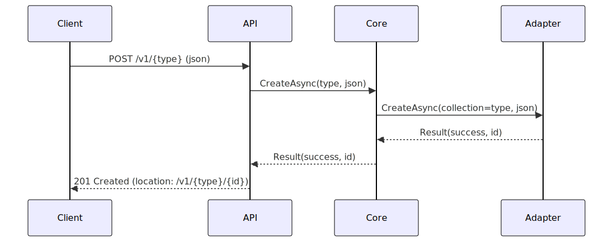
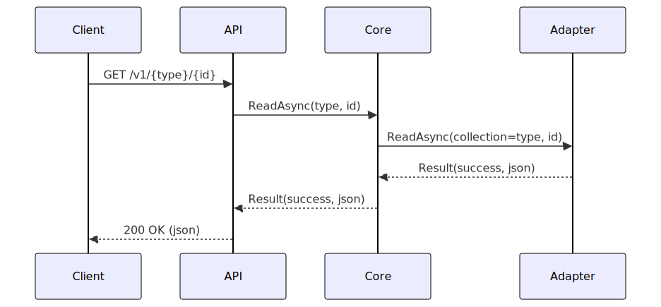

# Cardinn — 设计说明 (design.md)

目标：设计一个通用的数据库读写平台（可扩展、多适配器、JSON-first），并提供接口契约、错误模型、示例与文档生成要点。

目录
- 概览
- 设计目标
- 架构概览（分层）
- 关键契约与接口（概念说明）
- 错误与结果模型
- 数据示例说明（文字形式）
- HTTP API 概要（端点说明）
- 扩展性与适配器模式
- 审计与日志
- 测试与 CI 建议
- 附录：流程说明与变更记录

概览
Cardinn 平台目标是提供一个通用的数据读/写抽象层，支持关系型与非关系型后端（通过适配器）、以 JSON 文档为首选数据载体（支持动态 schema）、并保持小而清晰的接口契约和统一的错误/结果模型。

设计目标（具体）
- 单一职责、低耦合：核心逻辑不包含具体存储实现。
- 可替换适配器：运行时可替换不同存储适配器。
- 以契约优先：通过接口契约定义行为（在文档中以文字阐述接口意义，而非示例代码）。
- 友好的调试与运维：统一日志、审计与性能计数。

架构概览（分层说明）
建议分层并职责清晰：
- API Layer：接收请求（HTTP/gRPC），执行轻量验证、鉴权与 tracing，将请求转交 Core 层。
- Core CRUD Service：实现业务无关的 CRUD 协议与流程控制，基于契约调用 Storage Adapter。
- Storage Adapters：后端具体实现（Sql、Mongo、文件、本地内存等）。
- Audit/Logging：独立审计与日志组件，接收并持久化来自 Core 的审计事件和操作元数据。

交互示意（文字版）
1. 客户端发送请求到 API Layer（HTTP 或 gRPC）。
2. API Layer 验证、鉴权并转发到 Core CRUD Service。
3. Core 根据注册的 Storage Adapter 执行持久化或查询操作。
4. Core 将审计事件发送到 Audit/Logging 以便存档和查询。
5. Storage Adapter 与底层数据库交互并返回结果给 Core，再由 Core 返回 API 层。

关键契约与接口（概念说明）
- Result 类型：建议使用统一的结果包装，包含成功/失败标识、可选数据载体、错误码与错误消息，以及可选的元数据字段（例如 traceId、validation details）。
- 存储适配器（概念）：每个后端实现一个适配器，适配器负责连接管理、后端特有序列化/反序列化、事务管理、查询转换和错误映射。
- CRUD 服务（概念）：Core 层暴露的 CRUD 服务以契约形式定义行为（创建、读取、更新、删除、查询），但文档中用文字描述这些契约的预期输入/输出与错误语义，而不包含代码示例。

接口设计要点（文字指导）
- I/O 方法应返回统一的 Result，避免直接抛出未经捕获的异常，使错误语义可序列化与可观察。
- 使用 JSON 文档作为传输载体以支持动态字段和未来扩展；必要时在 Core 层做 schema 校验或策略化的字段映射。
- 将后端特性（如事务、批量操作、特定查询语法）封装在适配器层，不在 Core 中泄露实现细节。

错误与结果模型
- 建议包含字段：IsSuccess、Value（可选）、ErrorCode、ErrorMessage、Metadata（可选）。
- 示例错误码（建议集合）：NotFound、Conflict、ValidationFailed、AdapterError、Unauthorized、InternalError。
- 错误处理策略：适配器负责捕获底层异常并映射为通用错误码；Core 层根据业务语义可进一步细化错误码并补充上下文信息。

数据示例说明（文字形式）
- 文档的基本结构建议包含：唯一标识（id）、类型标识（type）、元数据（例如创建者、时间、标签）以及任意的 payload 字段用于存放业务数据。
- 查询请求可以采用 JSON 形式的过滤/分页/排序描述（在适配器层定义具体语法或映射到后端查询语言）。

HTTP API 概要（端点说明，文字）
建议以 OpenAPI 3.0 定义对外接口并使用语义化版本号，例如 /v1/ 前缀。基础端点可以包括：
- POST /v1/{type}：创建文档。
- GET  /v1/{type}/{id}：按 id 读取文档。
- PATCH /v1/{type}/{id}：局部更新文档（JSON Patch 或适配器定义的格式）。
- DELETE /v1/{type}/{id}：删除文档。
- POST /v1/{type}/query：复杂查询，接收 JSON 查询描述并返回匹配集合。

扩展性与适配器模式（文字）
- 每个后端实现一个适配器（例如 Sql、Mongo、File、InMemory）。
- 通过依赖注入在运行时选择具体适配器；适配器承担后端连接与查询翻译责任。
- 适配器应导出能力描述（例如是否支持事务、是否支持复杂聚合查询），以便 Core 根据能力选择不同策略。

审计与日志（文字）
- 在 Core 层定义审计事件格式（操作类型、用户、时间、目标 id、变更摘要等），并将事件发送到独立的审计组件或队列。
- 日志应包含 traceId，方便链路追踪与性能分析。

测试与 CI 建议（文字）
- 单元测试：使用 Mock/Stub 适配器验证 Core 行为；使用 InMemory 适配器做快速集成测试。
- 集成测试：为每个真实适配器（Sql、Mongo）建立测试套件，可在 CI 中使用容器或受控测试实例运行。
- CI 流程建议包括：构建、静态检查、单元测试、适配器矩阵的集成测试、文档构建（例如 docfx）。

迁移与版本兼容（文字）
- 外部 API 使用语义化版本（例如 /v1/）；对于破坏性更改发布新主版本。
- 数据迁移由适配器或迁移工具提供，支持可回滚的迁移路径与变更脚本。

附录：流程说明（文字）
创建流程示例（文字版）：
1. 客户端发起创建请求到 API。
2. API 验证并转交 Core 的创建逻辑。
3. Core 调用已注册的适配器执行持久化。
4. 适配器返回统一格式的结果，Core 记录审计并将结果返回给 API。

变更记录
- 2025-10-25 初始设计文档（此版本：删除所有示例代码片段与 Mermaid 区块，统一为纯文本说明，修复未闭合代码块问题）。

### 创建流程图

### 读取流程图

